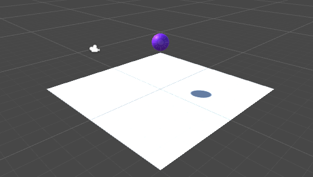
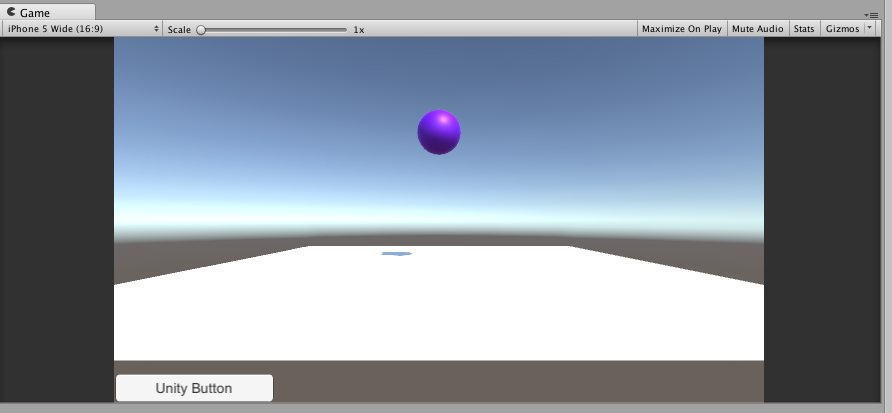
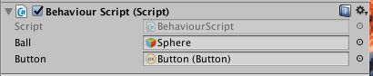
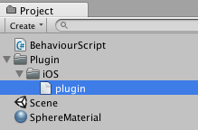
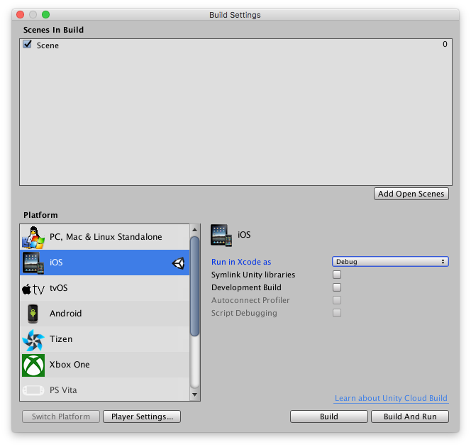
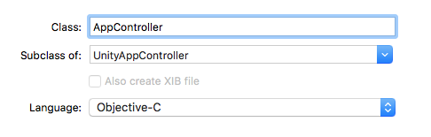
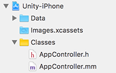

# 'Unity C# <> Xcode Objective-C' Bridge

## Unity Scene set up
- First set up a new scene in Unity and add a plane with a simple sphere above it. So we can interact with it later.
- Make sure the purple `Sphere` has a `RigidBody` and `Use Gravity` is enabled. 

> 💡 You can add some materials to it, so it stands out. And maybe move the `Sphere` a bit up (on the y-axis).



If you run the scene the purple sphere would drop on the white plane.

## Unity GUI
Next up we're going to add a GUI button to send information to Objective-c
- Add a `UI -> Button`
- It should be aligned to the left-bottom
- Rename the button's text to your liking.



## Unity Script
- Next stop, create a new C# Script, name it `BehaviourScript` or anything to your liking

Open the script and use this code:

```cs
using System.Collections;
using System.Collections.Generic;
using UnityEngine;
using UnityEngine.UI;
using System.Runtime.InteropServices;

public class BehaviourScript : MonoBehaviour {
	public GameObject ball;
	public Button button;

	[DllImport ("__Internal")]
	private static extern void calledFromUnity();

	void Start () {
		button.onClick.AddListener (Tap);
	}

	void Tap()  {
		calledFromUnity();
	}

	void Bounce(string direction) {
		Debug.Log ("Bounce!");
		ball.GetComponent<Rigidbody>().AddForce(transform.up * 300);
	}
}
```

Code blocks explained:

```cs
using System.Runtime.InteropServices;
```

Used for external communication.

```cs
[DllImport ("__Internal")]
private static extern void calledFromUnity();
```
This creates a reference to the c function `calledFromUnity()`, which will be implemented in your Xcode project later on.

```cs
void Start () {
	button.onClick.AddListener (Tap);
}

void Tap()  {
	calledFromUnity();
}
```
Would listen for a click event on the `button`. When a click occurs the c-function `calledFromUnity()` will be called and invoked in (Obj-)C.

```cs
void Bounce(string direction) {
	ball.GetComponent<Rigidbody>().AddForce(transform.up * 300);
}
```	
This would make the ball bounce. `Bounce(string)` will be called from Obj-c / Xcode. 

Now go back into Unity and add the `BehaviourScript` to your plane and connect `Button` and `GameObject`.




At this stage you would have a button which would do nothing (yet) and have a function which isn't called (yet).

## iOS Plugin
- Create a new folder called `Plugin` in your project
- Create a new folder called `iOS` in `Plugin`
- Create a new file called `plugin.mm` in that `iOS` folder

> ⚠️ It's important to add these files to this specific folder. Adding them from Xcode would overwrite the `plugin.mm` once you (re)build the Unity project.



`plugin.mm` should contain the following code:

```c
extern "C"
{
    void calledFromUnity() {        
        [[NSNotificationCenter defaultCenter] postNotificationName:@"UnityNotification" object:nil];
    }
}

```

This is where the `calledFromUnity()` function we declared earlier would return. We make the default `NSNotificationCenter` post a notification with the name `"UnityNotification"`, this way we can intercept it in our own `UIViewController` later on.

> 💡 There are a few options regarding dispatching methods from C to Objective-C's main view, but for now we'll stick to this.

## Build the project
- Open `Build Settings`: `File -> Build Settings` or press `⇧⌘B`.
- Use the following settings:
 
- Press `Build`
- Wait ...
- After a while your Xcode project should be created
- Open `Unity-iPhone.xcodeproj`

## A UIViewController on top of Unity
- Create a new Objective-C class in the `Classes` folder name `AppController`.





> 💡 Make sure you have a `.mm` extension for the implementation file and it's linked to the `Unity-iPhone` target.


- Make sure `AppController` extends `UnityAppController`

The two files will look like this:

```objc
// .h

#import "UnityAppController.h"

@interface AppController : UnityAppController {
    
}
    
@end
```

```objc
// .mm

#import "AppController.h"

@implementation AppController {
    UIButton *btn;
}
    
- (void)startUnity:(UIApplication *)application {
    [super startUnity:application];
    
    [[NSNotificationCenter defaultCenter] addObserver:self selector:@selector(notificationFired:) name:@"UnityNotification" object:nil];
    
    UIViewController *vc = [UIViewController new];
    [vc.view setFrame:self.window.bounds];
    [vc.view addSubview:_rootController.view];
    [self.window setRootViewController:vc];
    
    btn = [UIButton buttonWithType:UIButtonTypeSystem];
    [btn setTitle:@"To Unity" forState:UIControlStateNormal];
    [btn setBackgroundColor:[UIColor whiteColor]];
    [btn setTintColor:[UIColor orangeColor]];
    [btn setFrame:CGRectMake(10, 10, 100, 50)];
    [btn addTarget:self action:@selector(tapButton:) forControlEvents:UIControlEventTouchUpInside];   
    [vc.view addSubview:btn];
}

- (void)tapButton:(UIButton *)sender {
    UnitySendMessage("Plane", "Bounce", "Up");
}
    
- (void) notificationFired:(NSNotification *)notification {
	NSString *originalTitle = [btn titleForState: UIControlStateNormal];
	[btn setTitle:@"😎" forState:UIControlStateNormal];
	dispatch_after(dispatch_time(DISPATCH_TIME_NOW, (int64_t)(1 * NSEC_PER_SEC)), dispatch_get_main_queue(), ^{
        [btn setTitle:originalTitle forState:UIControlStateNormal];
	});
}
@end

```

Lets have a look at each code blocks:

```objc
@implementation AppController {
    UIButton *btn;
}
```
A `btn` is declared so we can use it among the whole class instance.

```objc
- (void)startUnity:(UIApplication *)application {
    [super startUnity:application];
```

Since `AppController` extends `UnityAppController` and `startUnity:` is called when the Unity view is loaded, this method will be invoked once the Unity controller is started.

```objc
[[NSNotificationCenter defaultCenter] addObserver:self selector:@selector(notificationFired:) name:@"UnityNotification" object:nil];
```

```objc
- (void) notificationFired:(NSNotification *)notification {
	NSString *originalTitle = [btn titleForState: UIControlStateNormal];
	[btn setTitle:@"😎" forState:UIControlStateNormal];
	dispatch_after(dispatch_time(DISPATCH_TIME_NOW, (int64_t)(1 * NSEC_PER_SEC)), dispatch_get_main_queue(), ^{
        	[btn setTitle:originalTitle forState:UIControlStateNormal];
	});
}
```
Listen for the `"UnityNotification"` notification to be fired and call the `notificationFired:` method.
`notificationFired:` will change the title of the button and after 1 second set it back to the original one.

```objc
UIViewController *vc = [UIViewController new];
[vc.view setFrame:self.window.bounds];
[vc.view addSubview:_rootController.view];
[self.window setRootViewController:vc];
```
This would create a new `UIViewController` and places the original unity viewcontroller in it. This way we can add our own UI on top of Unity.

```objc
btn = [UIButton buttonWithType:UIButtonTypeSystem];
[btn setTitle:@"To Unity" forState:UIControlStateNormal];
[btn setBackgroundColor:[UIColor whiteColor]];
[btn setTintColor:[UIColor orangeColor]];
[btn setFrame:CGRectMake(10, 10, 100, 50)];
[btn addTarget:self action:@selector(tapButton:) forControlEvents:UIControlEventTouchUpInside];   
[vc.view addSubview:btn];
```

Creates the actual button and places it on the newly created `UIViewController`

```objc
- (void)tapButton:(UIButton *)sender {
    UnitySendMessage("Plane", "Bounce", "Up");
}
```

The button tap will invoke `tapButton:` and will fire `UnitySendMessage` with 3 parameters:

- `"Plane"`: The name of the `GameObject` in Unity
- `"Bounce"`: The name of the function in the `BehaviourScript.cs` Unity C# Script.
- `"Up"`: The parameter to be used in the `Bounce(string)` function. (For now this hasn't any effect, you can place any string in it)


## main.mm
- Open `main.mm` (also in the Classes folder) and change this line:

```c
const char* AppControllerClassName = "UnityAppController";
```

to

```c
const char* AppControllerClassName = "AppController";
```
This way it will load the `AppController` class instead of the `UnityAppController` class.

## Results


